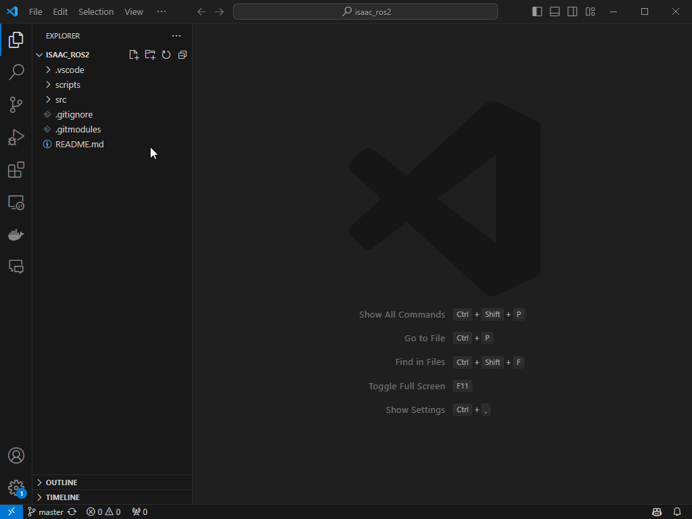

# README.md

The following steps will guide you to setup the ROS2 Bridge extension for Isaac Sim.



## Prerequisites

- From [ms_iot](https://ms-iot.github.io/ROSOnWindows/GettingStarted/SetupRos2.html), 
    - Ensure meet the prerequisites for ROS 2 Humble.
    - Install Visual Studio 2019 with the Desktop Development with C++ workload and the English language pack.
    - Install the Chocolatey package manager, see [here](https://ms-iot.github.io/ROSOnWindows/GettingStarted/SetupRos2.html#install-windows-package-manager) for instructions.
- From the start menu, look for x64 Native Tools Command Prompt for VS 2019.
- Open the command prompt as administrator.
- Run the following to install ROS 2 Humble.
    ```
    choco source add -n=ros-win -s="https://aka.ms/ros/public" --priority=1
    choco install ros-humble-desktop -y --execution-timeout=0 --pre
    ```

## Setup

- Clone the repository.
    ```
    git clone --recurse-submodules https://github.com/cr0Kz/isaac_ros2.git
    ```
- Open the repository with Visual Code.
- Open a new terminal in Visual Code "Terminal -> New Terminal".

ROS 2 will be activated in the terminal and the isaac_ros workspace will be automatically built the first time you open the terminal.

After the workspace is built, it will automatically source the ROS 2 environment and the isaac_ros workspace.

## Credits

- [ROS for Windows](https://ms-iot.github.io/ROSOnWindows/GettingStarted/SetupRos2.html)
- [Omniverse Isaac Sim](https://docs.omniverse.nvidia.com/isaacsim/latest/installation/install_ros.html#isaac-sim-app-install-ros)
- [ROS 2](https://docs.ros.org/en/humble/index.html)


